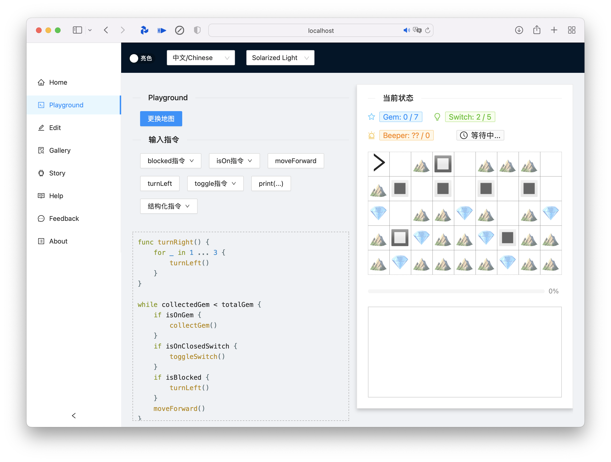

# Shizuku (WIP)

A front-end for [simulatte](https://github.com/kokoro-aya/simulatte). Run on umijs/antd.

**Currently this project is under refactoring. The goals of this refactor is listed below the description.**

This project provides a simple interface to present the features of Amatsukaze or Simulatte, a simple application inspired by
Karel and Playgrounds. The Amatsukaze consists of a fictive programming language and a grid where users could control
the character to move around and interact with it, which has been discontinued. The Simulatte consists of achieving the similar
features of game by using Kotlin DSL.

The Shizuku is a SPA with following features:

- Basic input/output/grid to present the gaming experience
- A modal to change and load another map (TODO)
- A page of map editing (TODO)

Here are several features that could be achieved in the current refactor:

- [x] Refactor with TypeScript
- [x] Adapt to the new server side (at last, I have decided to adapt to the [simulatte](https://github.com/kokoro-aya/simulatte) server instead of another one)
- [x] Adapt to Monaco Editor, link the editor to the playground and add support for themes
- [x] i18n
- [ ] ~~dark mode~~ (won't achieve due to limits of ant design)
- [x] Some predefined maps and possibility to switch the map
- [ ] A simple map editor
- [ ] A connected server and code evaluation *on the fly* (need to adapt the server at the same time)
- [ ] A gallery of maps and maybe a map server to persist data

The refactoring is expected to end at around 26/04.
