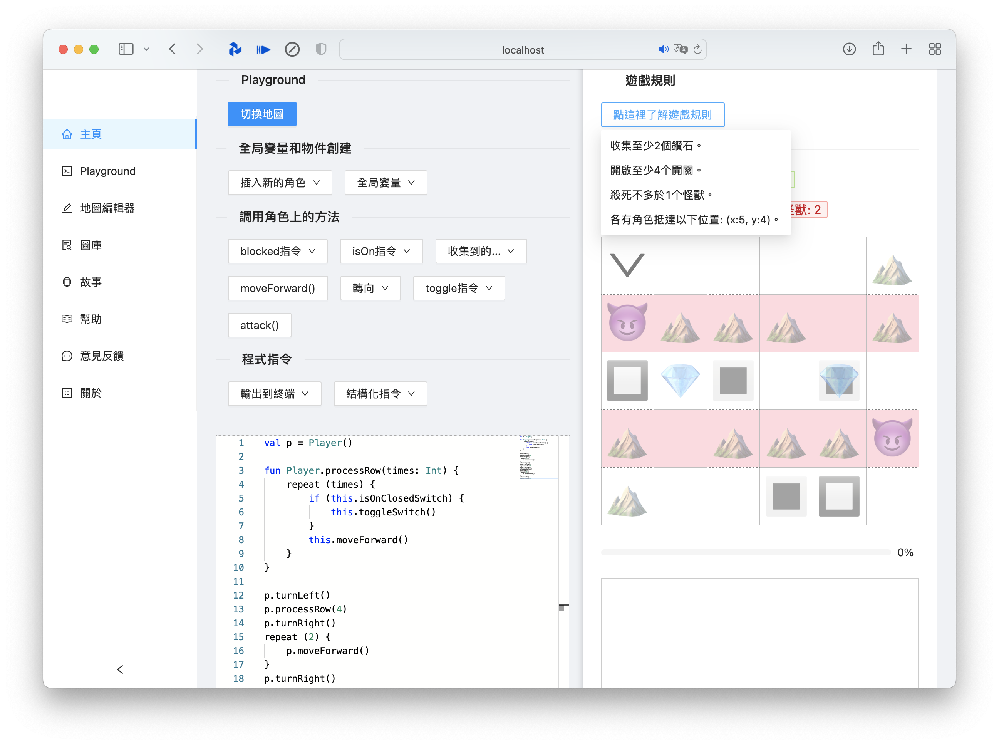
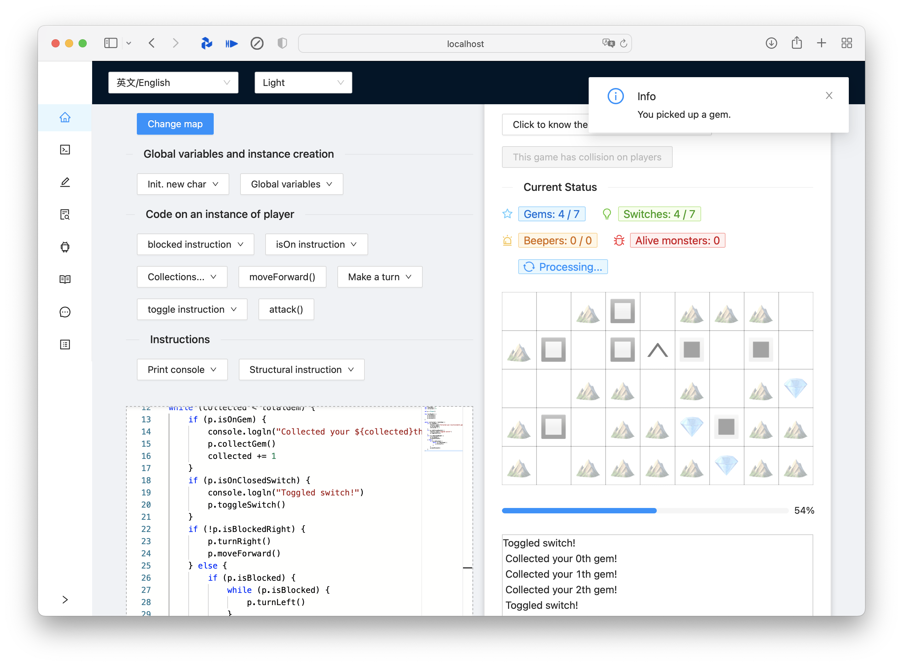

# Project Shizuku

A front-end for [simulatte](https://github.com/kokoro-aya/simulatte). Run on umijs/antd/monaco editor.




## Introduction

This project provides a simple interface to present the features of Amatsukaze or Simulatte, a simple application inspired by
Karel and Playgrounds. The Amatsukaze consists of a fictive programming language and a grid where users could control
the character to move around and interact with it, which has been discontinued. The Simulatte consists of achieving the similar
features of game by using Kotlin DSL.

The Shizuku is a SPA with following features:

- Basic input/output/grid to present the gaming experience
- A modal to change and load another map
- A page of map editing (TODO)

## How to test

NPM is required.

To run the project, go to the project's folder in terminal, then:

- Install dependencies via `npm install`
- Setup a local server via `npm start`
- The site could be accessed from `localhost:8000`
- Run the [Simulatte](https://github.com/kokoro-aya/simulatte) program (please use version newer than ver 3.3.4) in a separated terminal in order to be able to connect to server
- Code something in Kotlin and explore

See [the wiki of Simulatte](https://github.com/kokoro-aya/simulatte/wiki) to know about how the playground is defined and how to use
the Kotlin language to direct the playground to work using your code.

## How to play

- Initialize a player

  ```kotlin
  val p = Player() // or a Specialist() 
  ```

  see the number of `>` in the playground and consult their info (id, role) in dropdown)

  the player with lower id will be first used to fulfill creation of your player unit

- Make it do something

  ```kotlin
  p.moveForward()
  p.toggleSwitch()
  p.collectGem()
  p.turnLeft()
  // ... and so on
  ```

  see the wiki for a comprehensive list of available commands

- Use structural instructions for repeated patterns

  ```kotlin
  for (i in 1 until 4) {
      // do something ...
  }
  ```

  or

  ```kotlin
  val a = 3
  while (a > 0) {
      // do something ...
      a -= 1
  }
  ```

  or

  ```kotlin
  val goal = 10
  // do something ...
  if (p.collectedGem < 10) {
      // do something ...
  }
  ```

  see the wiki for a comprehensive list of available global variables that you can rely on to check the game's status

- Observer the game, recode it and have fun
- You may write code that runs into error or wrong codes, the interface will reflect them and you can see the error occurred in
server side as well to confirm it

## Technic issues

Due to some limit of server side, methods like `println` or `print` will not output to the console in the front-end. Use `console.log`
and `console.logln` instead.

Due to limit of Ant Design, dynamic dark mode cannot be achieved or could be very hard to implement so the idea was abandoned.

The Simulatte server has implemented some advanced features such as map leveling, platforms/locks, creative mode, .. As this
server is imperfect and presents tons of bugs regarding these advanced features, they are not featured in this project. Still,
I have implemented data structures regarding these features, but only reserved for future usage.

Besides, the game type is `default` only and no `creative` type. The idea of this project is just to feature some basic ideas
of the playground.

The layout is on 2d, this has created difficulty to present information (for example, when different objects overlap), I have
displayed them in the tooltip prompt. This is not a good way to present info in a game and it's not fun, but I don't have a better
way.

For testing purpose, some maps present in the mocks contain a sample code in the local variable `code`, you can use this code to
test the corresponding map. The default map to be loaded is set to map4 in mock. This could be changed in the future.

## Several implemented features since recent update

- [x] Refactor with TypeScript
- [x] Adapt to the new server side (at last, I have decided to adapt to the [simulatte](https://github.com/kokoro-aya/simulatte) server instead of another one)
- [x] Adapt to Monaco Editor, link the editor to the playground and add support for themes
- [x] i18n in a typed way (4 languages are supported: zh-CN, zh-TW, en-US and fr-FR)
- [x] Some predefined maps and possibility to switch the map

## Known issues

- The first connection to the server may take longer to response, once the server is set up, it will be much faster to connect to the server and receive response.
This is caused by the usage of reflection and ki-shell in the server side.
- You have to wait awhile for the map menu to be pop over
- The ending-game notice might be pop up in the first time as soon as the game is in process, I have fixed this issue but not sure if it persists.
- You may need to reset the game to make it possible to launch a game (while clicking reset, the playground will keep the same)
- Bottom lines of the editor box and dashboard box is not aligned on load, but you could resize the page, and then they will be aligned at resizing events

More documentations are under construction.

## Features that could be implemented later

- [ ] Upgrade to use Umi4 (Umi Next) and make use of more powerful mechanisms such as mock.js
- [ ] A simple map editor
- [ ] A connected server and code evaluation *on the fly* (need to adapt the server at the same time)
- [ ] A gallery of maps and maybe a map server to persist data

## Main libraries used

- React / ver 17
- UmiJS / ver 3.5.0 with @umijs/preset, @umijs/test and @umijs/types
- Ant Design / ver 5.0 with @ant-design/pro-layout
- Monaco Editor / ver 0.33.0
- @monaco-editor/react / ver 4.4.2

